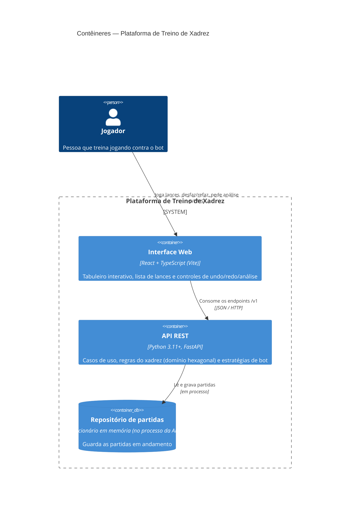

# Diagrama de Contêineres (C4 — Nível 2)

Visão dos contêineres que compõem a plataforma e como o jogador interage com
eles. O foco é mostrar a separação entre a interface (SPA) e a API, e que a
persistência hoje vive **no mesmo processo** da API (repositório em memória,
ver [ADR-004](../adrs/ADR-004.md)).

## Leitura

- A **Interface Web** não contém regra de xadrez: ela só desenha a posição
  (a partir da FEN) e oferece ao jogador os lances que a API já marcou como
  legais. Isso sustenta a confiabilidade — a única autoridade sobre o que é
  legal é o domínio.
- A **API REST** é a fronteira do monolito modular. Internamente segue a
  Arquitetura Hexagonal: o adaptador HTTP fala com os casos de uso, que falam
  com o domínio através de portas (ver [ADR-003](../adrs/ADR-003.md)).
- O **Repositório** é um detalhe substituível: a aplicação depende apenas da
  porta `RepositorioDePartidas`; trocar a memória por um banco é escrever
  outro adaptador, sem tocar em domínio ou aplicação.
