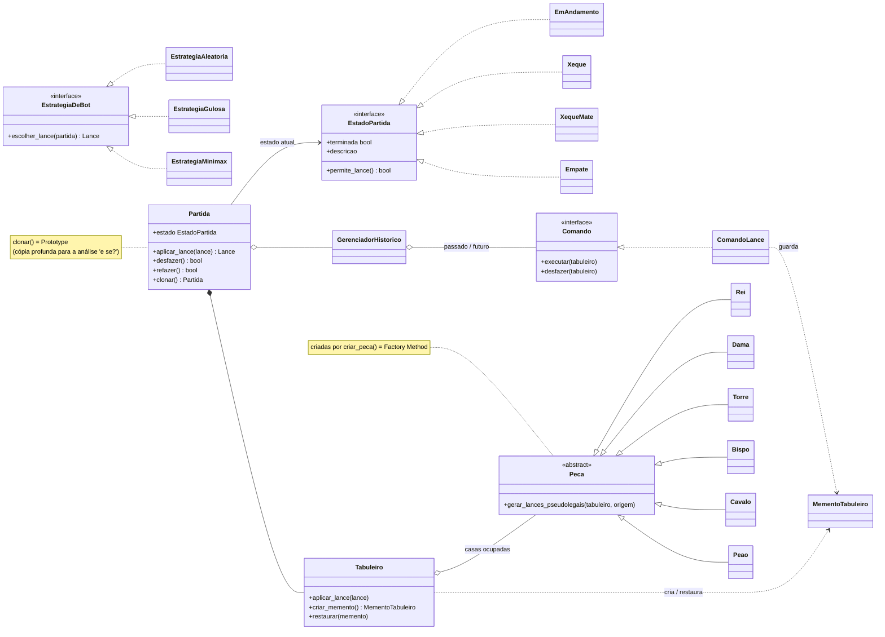

# Diagrama de Classes — Padrões GoF

Mostra onde cada um dos cinco padrões GoF aparece no domínio e como eles se
articulam em torno do agregado central `Partida`. Detalhamento em prosa em
[`docs/padroes-gof.md`](../docs/padroes-gof.md).

## Os cinco padrões no diagrama

| Padrão | Onde |
|--------|------|
| **Strategy** | `EstrategiaDeBot` e suas implementações (níveis de bot intercambiáveis) |
| **State** | `EstadoPartida` e os estados concretos (mate, empate, xeque, em andamento) |
| **Command** | `Comando` / `ComandoLance` executados pelo `GerenciadorHistorico` |
| **Memento** | `MementoTabuleiro`, criado/restaurado pelo `Tabuleiro` (originador) |
| **Prototype** | `Partida.clonar()` — cópia independente para análise |
| **Factory Method** | `criar_peca()` produz a subclasse de `Peca` certa a partir do símbolo FEN |

> Observação: o enunciado pede **implementar os cinco** padrões e **detalhar três**.
> Os escolhidos para detalhamento são **Strategy**, **State** e **Command + Memento**
> (tratados como um par, pois operam juntos no undo/redo).
